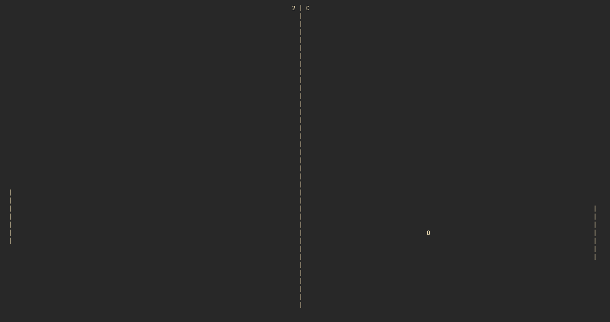

# Ping Pong in the terminal

This is a simple ping pong game that you can play in the terminal. It is written in C++. 
It doesn't have any dependencies, so you can compile it with any C++ compiler or CMake.
It only runs on Linux and MacOS.
You play against a simple AI that moves the paddle up and down to hit the ball.



## How to play
- `j` to move the paddle down
- `k` to move the paddle up
- `q` to quit the game

## How to compile
run cmake 
```bash
mkdir build
cd build
# compile
cmake ..
make
```
run program
```bash
./target/ping_pong
```
